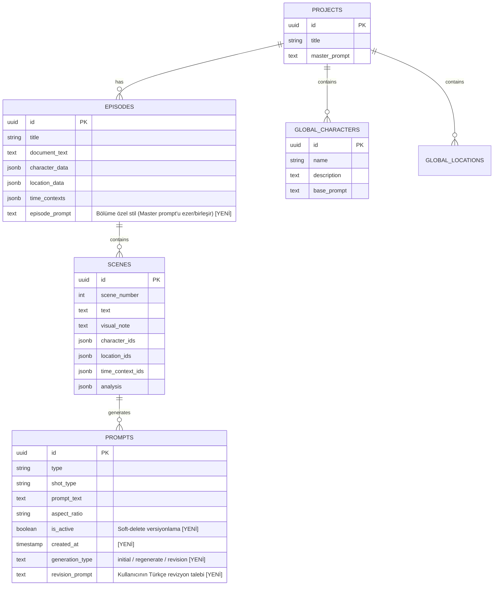
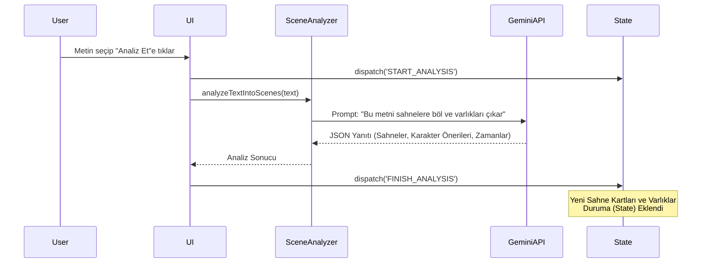
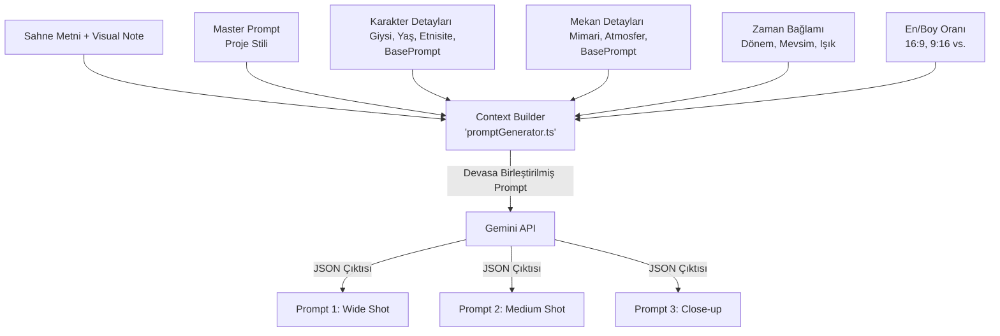

# Prompt Forge 4.2.1 - Açık Kaynak Mimari ve Üretim Rehberi (Anlayana)

Story Shot Studio (SSS), sinemacılar, storyboard çizerleri ve görsel hikaye anlatıcıları için tasarlanmış, **tamamen tarayıcı üzerinde (client-side) koşan**, yapay zeka destekli bir sahneleme (storyboarding) motorudur.

Normal bir web uygulaması gibi değil, **"Kalın İstemci" (Thick Client)** mantığıyla çalışır. NodeJS veya Python gibi bir backend sunucusu yoktur. Tüm karar mekanizmaları, veritabanı senkronizasyonları, prompt mühendisliği ve durum yönetimi tarayıcının belleğinde gerçekleşir. Veriler ise kalıcı depolama için Supabase'e gönderilir.

Aşağıda, bu sistemin en temel parçasından en tepe yapısına kadar her bir hücresinin (kodların, dosyaların ve mantığının) nasıl çalıştığı detaylıca açıklanmıştır.

---

## 1. Yüksek Seviye Sistem Mimarisi (High-Level Architecture)

düttürü dünya 
düttürü dünya 
düttürü dün

Story Shot Studio, frontend ağırlıklı (React + Vite) bir yapıya sahiptir. Tüm ağır iş mantığı (AI istemi oluşturma, sahne analizi, metin parçalama) istemcide çalışır ve durum Senkronizasyonu (State Sync) için Supabase'i (PostgreSQL) kullanır.

```mermaid
graph TD
    subgraph Frontend [İstemci (React + Vite)]
        UI[Kullanıcı Arayüzü / Paneller]
        State[Global State: useAppState]
        Parser[Text Parser & Splitter]
        AI_Orchestrator[AI Provider (Resilient JSON Parser)]
    end

    subgraph Backend [Supabase]
        DB[(PostgreSQL)]
        Auth[Supabase Auth]
    end

    subgraph External [Dış Servisler]
        Gemini[Google Gemini API]
    end

    UI <-->|dispatch / select| State
    Parser --> State
    State <-->|Batch Sync (Debounced)| DB
    AI_Orchestrator <-->|Prompt Generation| Gemini
    State --> AI_Orchestrator
    AI_Orchestrator --> State
```

---

## 2. Veri Hiyerarşisi ve Supabase Mimarlığı

Sistemin kalbinde yatan veri modeli, klasik film üretim aşamalarına sadık kalınarak tasarlanmıştır.

### a. Temel Tablolar ve Roller



1.  **Projects (Projeler):** En tepe birimdir. Bir filmi veya kitabı temsil eder. Sanat yönetiminin anayasası olan **Master Prompt** burada yaşar (örn: *"Görsel tarzımız 8K, karanlık fantezi, yönlü ışık"*).
2.  **Karakterler ve Mekanlar (Varlıklar/Entities):** Bunlar projeye bağlıdır. Senaryonun herhangi bir bölümünde (Episode) kullanılabilirler. Supabase'de `characters` ve `locations` tablolarında tutulmazlar. SSS, aşırı esneklik (NoSQL vari) sağlamak için bunları `episodes` tablosunda `JSONB` formatında tutar.
3.  **Episodes (Bölümler):** Projenin alt kırılımlarıdır. "1. Perde", "Bölüm 3" gibi düşünülebilir. Her bölümün kendine has bir **Episode Prompt** özniteliği vardır. Bu, Master Prompt'u silmeden onun üzerine binen "Bölüm Özel Tarzıdır".
4.  **Scenes (Sahneler):** Bölüm metninin içinden, yapay zeka (Sahne Analisti) tarafından tek tek damıtılan **statik kamera kareleridir.** Orijinal cümleyi ve o kareyi anlatan kısa yönergeleri içerir.
5.  **Prompts (İstemler):** Sahnenin görselleştirilmesi için üretilmiş, Midjourney veya Stable Diffusion'a yedirilmeye hazır detaylı İngilizce metinlerdir.

### b. "Stable Kriptografik Kimlikler" (UUIDv4) Yöntemi
Frontend ile Backend arasındaki en büyük savaşlardan biri id çakışmalarıdır. Bizim mimarimizde Supabase'in ID üretmesine güvenilmez.
*Nasıl Çalışır:* Bir karakter, sahne veya prompt üretildiği an (Örneğin `sceneAnalyzer.ts` içinde JSON dönüldüğü ilk milisaniye), tarayıcı kodu buna `crypto.randomUUID()` ile devasa, kırılmaz bir kimlik basar.
Supabase'e veriler yollanırken `INSERT` yerine **`UPSERT`** (Update or Insert) kullanılır. Eğer o UUID daha önce gönderildiyse güncelle, gönderilmediyse yarat. Bu sayede tarayıcı ne kadar sekmeye açılıp kapanırsa kapansın asla veri kopyalanması (duplicate) yaşanmaz.

### c. Soft-Delete (Tarihi Silmeme Kuralı)
`prompts` tablosunda `is_active` (boolean) diye bir sütun vardır. Eğer bir kullanıcı promptu beğenmeyip "Sil", "Revize Et" veya "Yenile" derse, o prompt **asla veritabanından Hard Delete ile silinmez.** Sadece `is_active = false` yapılır. Böylece arayüzde görünmez ama veritabanında hikaye geçmişi olarak gömülü kalır. (Bu özellik "Prompt History" kısmında hayat kurtarır).

---

## 3. Kanayan Yarayı Kapatmak: State Management (Durum Yönetimi)

Uygulamada binlerce kelime, onlarca sahne kartı, promptlar ve text area'lar vardır. React'ın standart `useState`'i ile her tuşa basışta tüm ekranı baştan çizmek (re-render) bilgisayarı dondurur.

### Çözüm: `src/hooks/useAppState.ts`
Burası sistemin "Tek Doğru Kaynağı"dır (Single Source of Truth). Dev bir `useReducer` barındırır.
Tüm veri akışı sadece bu reducer'a atılan "Eylemler" (Actions) ile değişir: `ADD_SCENE`, `UPDATE_PROMPT`, `UPSERT_CHARACTER` vb.

### Optimistik UI ve Debounced Kayıt (Auto-Save)
Kullanıcı bir şey yazdığında sistem "Lütfen bekleyin, Supabase'e kaydediyorum" demez.
1.  **Anında Görüntü (Optimistic):** Tuşa bastığınız an Reducer state'i yeniler ve arayüz değişir. Hız mükemmeldir.
2.  **Debounce Timer (Sessiz Sayaç):** `Index.tsx` içinde `useEffect` ile bağlı bir geri sayım vardır. Siz yazarken bu sayaç sıfırlanır. Siz klavyeyi bıraktıktan tam **2 saniye sonra** arkaplan görevi tetiklenir: *"Git mevcut State'in karbon kopyasını Supabase'e UPSERT et."*
3.  **Hata Telafisi:** Eğer internet kesilirse sistem paniklemez. `supabaseQueries.ts` içindeki `withRetry` fonksiyonu sayesinde, gönderim başarısız olursa 2 saniye bekler, sonra 4 saniye, sonra 8 saniye... (Exponential Backoff). İnternet geldiğinde veriyi fırlatır.

---

## 4. İki Başlı Yapay Zeka (AI Modülleri)

Sistem bir metni alıp görsel prompta çevirmek için tek bir komut ("Şuna resim çiz") kullanmaz. Birbirine bağlı ve son derece kontrollü iki aşamalı bir "Boru Hattı (Pipeline)" vardır.

### Aşama 1: Sahne Analisti (`src/lib/sceneAnalyzer.ts` & `sceneParser.ts`)



*   **Görevi:** Dev metni parçalara (Sahne Kartlarına) ayırmak.
*   **Kesin Kurallar:** Bu AI'ın beynine (`SCENE_PARSING_PROMPT`) öyle emirler verilmiştir ki; hareket (video) veya soyut kavram tanımaz.
    *   *Senaryo Cümlesi:* "Topraktan su fışkırdı ve adamlar sevindi."
    *   *Yasak:* "Suyun fışkırması" diye sahne kuramaz (Çünkü video değil, resim üretiyoruz).
    *   *Böldüğü Hal:* Sahne 1: "Topraktan çıkan ilk damla (close-up)". Sahne 2: "Havada asılı sular (high-speed freeze)". Sahne 3: "Gülümseyen adamların yüzleri".
*   Eğer döneceği JSON bozuksa (malformed) kod bunu try/catch ile yakalayıp düzeltmeye çalışır.
*   **⚠️ Bilinen Sorun:** Analiz prompt'u her cümleyi ayrı sahneye bölebiliyor, 70 sayfalık metinden 98 sahne çıkıyor. `sceneAnalyzer.ts` sistem prompt'una maksimum sahne sayısı sınırı eklenmesi gerekiyor.

### Aşama 2: Prompt Jeneratörü (`src/lib/promptGenerator.ts`)

Sistemin şaheseridir. "Tümünü Üret" butonuna basıldığında bir **"Context Builder" (Bağlam Toplayıcı)** çalışır. API'ye giden soru basit bir metin değil, muazzam bir bilgi dağıdır.



Peki `generatePromptsForScene` o bilgi dağını nasıl kurar?
1.  **Ham Sahne Metni:** Aşama 1'den gelen "Havada asılı sular".
2.  **Yönetmen Notu:** Kullanıcının karta yazdığı ekstra direktifler.
3.  **Karakterler & Mekanlar (Entity Injection):** Sahnede "Kral" varsa, Kralın yaşını, pelerinindeki işlemeyi, etnisitesini (visualDescription) alır ve dev İngilizce promptun "Characters:" kısmına **kaynak/mermi** olarak doldurur.
4.  **Zaman/Ortam:** "Kış", "Alttan vuran aydınlatma".
5.  **Master ve Episode Prompts:** Projenin (Red Komodo 8K vb.) ve Bölümün (Kabus Tarzı vb.) ana anayasasını en başa kilitler.

AI (Gemini) tüm bu karmaşık kuralları okur ve JSON olarak *"Geniş Açı"*, *"Omuz Üstü"* gibi farklı lens tipleriyle muazzam İngilizce promptlar döner. Yanıt bozuk gelirse sistem bunu yakalar, sonuna "Return ONLY JSON" yapıştırıp **Retry (Tekrar Dene)** mekanizmasını tetikler.

---

## 5. Gelişmiş Prompt Yaşam Döngüsü (Modifikasyonlar)

Sahne kartı oluştuktan sonra sistem statik kalmaz. Yönetmen (Kullanıcı) promptları hamur gibi yoğurabilir:

### a. Revizyon Sistemi (Türkçe Yönerge ile Nokta Atışı)
Üretilmiş, muazzam kalitede bir İngilizce prompt var ama siz sadece şunu istiyorsunuz: *"Adam elmaya değil de güneşe baksın."*

```mermaid
sequenceDiagram
    participant User
    participant InlinePromptCard
    participant Index.tsx
    participant revisePrompt()
    participant GeminiAPI

    User->>InlinePromptCard: Revizyon kutusuna "Hava yağmurlu olsun" yazar
    InlinePromptCard->>Index.tsx: onRevise(sceneId, promptId, instruction)
    Index.tsx->>revisePrompt(): revisePrompt(oldPromptText, instruction)
    revisePrompt()->>GeminiAPI: "Orijinal promptu koru, sadece yönetmen isteğini entegre et"
    GeminiAPI-->>revisePrompt(): Yeni İngilizce prompt
    revisePrompt()-->>Index.tsx: Güncel prompt metni
    Index.tsx->>Index.tsx: Eski prompt is_active=false, yeni prompt INSERT
    Note over Index.tsx: generation_type: 'revision'<br/>revision_prompt: "Hava yağmurlu olsun"
```

1.  Kart üzerindeki kalem (Revize) butonuna tıklayıp bu notu Türkçe girersiniz.
2.  Sistem `revisePrompt()` fonksiyonunu çağırır.
3.  Yapay zekaya giden çok özel uyarı şudur: *"Eski İngilizce ortam/ışık/lens promptunu AL. Kesinlikle bozma! Sadece kullanıcının şu Türkçe isteğini alıp mükemmelce o İngilizce promptun neresine yakışıyorsa oraya erit."*
4.  Eski prompt `is_active: false` yapılır. Yenisinin üzerine veri kimliği olarak `generation_type: 'revision'` ve `revision_prompt: 'Adam elmaya değil güneşe baksın'` mühürleri basılır.

### b. Tarihçe ve Geri Yükleme (Time Machine)
Zaman ikonu (`PromptHistoryModal.tsx`) tıklandığında, sistem o sahnenin veritabanındaki tüm "pasif/silinmiş" (`is_active: false`) promptlarını çeker.
Karşınıza adeta bir kod versiyonlama arayüzü çıkar:
*   [İlk Üretim] -> *Açıklama*
*   [Yeniden Üretim] -> *Açıklama*
*   [Revize] (💡 Kullanıcı isteği: Adam güneşe baksın) -> *Açıklama*

Kullanıcı "Bunu Kurtar" dediğinde pasif prompt uykusundan uyanır, mevcut olan ezilip uykuya yatırılır.

### c. Görsel Akıcılık (Loading States)
Tüm bu yapay zeka API işlemleri uzun (5-15 saniye) sürer. Uygulama "donmuş" gibi görünmesin diye:
*   Revize işlemi sürerken o kartın üzerine şeffaf bir Loading (Loader simgesi) biner (`InlinePromptCard`).
*   Bölümü komple üret derken, sahnenin `status` değeri `'generating'` olur ve sahnede Skeleton/Overlay yükleme ekranları çıkar.

---

## 6. Özetle Mimarinin Katmanları

- **Veritabanı (Supabase):** Dilsiz, sadece gönderilen JSON ve ID'leri ezberleyen güvenilir kasa.
- **Data Hook (`useAppState`):** Trafik polisi. Verinin UI'ı doldurmasını ve veritabanına yollanmasını sağlayan tek beyin.
- **Componentler (`SceneCard`, `EntityCardPanel` vs.):** Ekrana resim çizen aptal tuvaller. Sadece Reducer'a bağırırlar ("Bunu sil!", "Bunu değiştir!").
- **AI Modülleri (`sceneAnalyzer`, `promptGenerator`):** Bütün zekanın aktığı, metni sanata, yönetmen direktiflerini İngilizce kodlara çeviren motor.

Story Shot Studio, salt bir front-end uygulamasından öte, bu bileşenlerin birbirine sımsıkı kenetlendiği güçlü bir yönetmen asistanıdır.

---

## 7. Geliştirici Kuralları: "Do Not Touch"

Gelecekteki AI asistanların **bozmaması** gereken hayati yapılar:

1. **`supabaseQueries.ts` Exponential Backoff (`withRetry`):** Tekil `for` loop CRUD'a izin verilmez, her zaman `upsert` veya `.in()` kullanılır.
2. **`promptGenerator.ts` Context Merging Mimarisi:** `episodePrompt` merge sırası, JSON Retry döngüsü, `basePrompt` birleştirme hassas ve sıralıdır.
3. **`useAppState.ts` Devasa Reducer:** Yapısı narindir. Yalnızca `types/index.ts` ile eşleşen action/payload ile genişletin.
4. **`crypto.randomUUID()` Stable ID Sistemi:** Hiçbir varlığa geçici string ID atanmaz. Her varlık doğduğu anda gerçek UUID alır ve bu ID asla değişmez.

---

## 8. AI Modeli Kod Üretim Referansları (TypeScript Signatures)

```typescript
// promptGenerator.ts Ana Fonksiyon
export async function generatePromptsForScene(
  scene: SceneCard,
  characters: Character[],
  locations: Location[],
  masterPrompt: string,
  _apiKey?: string,
  _model?: string,
  aspectRatio: '16:9' | '4:3' | '1:1' | '9:16' = '16:9',
  sceneAnalysis?: SceneAnalysis,
  timeContexts?: TimeContext[],
  episodePrompt?: string
): Promise<GenerationResult>

// promptGenerator.ts Revizyon Fonksiyonu [YENİ]
export async function revisePrompt(
  oldPromptText: string,
  instruction: string  // Kullanıcının Türkçe talebi
): Promise<string>

// AppState (useAppState.ts)
export interface AppState {
  episodePrompt: string;
  masterPrompt: string;
  // Tüm alanlar için src/types/index.ts baz alınmalıdır.
}

// PromptVariant (Soft-Delete Uyumlu)
export interface PromptVariant {
  id: string;
  is_active?: boolean;       // false = geçmiş versiyon
  created_at?: string;
  generation_type?: 'initial' | 'regenerate' | 'revision';
  revision_prompt?: string;  // Türkçe revizyon talebi
}
```

---

## 9. Frontend (UI/UX) Durumu ve Yol Haritası

### ✅ Tamamlanan UI Özellikleri

| Özellik | Bileşen | Durum |
| :--- | :--- | :--- |
| Prompt History Modal (🕐 saat ikonu) | `PromptHistoryModal.tsx` + `SceneCard.tsx` | ✅ Aktif |
| ✨ AI ile Geliştir (Karakter & Mekan) | `EntityCardPanel.tsx` | ✅ Aktif |
| Prompt Revizyon Sistemi | `SceneCard.tsx` + `Index.tsx` | ✅ Aktif |
| Prompt geçmişinde generation_type rozeti | `PromptHistoryModal.tsx` | ✅ Aktif |
| Buton stilleri (ghost, minimal) | `SceneCard.tsx` | ✅ Aktif |
| Prompt modifikasyonunda loading animasyonları | `Index.tsx` + `SceneCard.tsx` | ✅ Aktif |
| Episode Style Textarea | `LeftPanel.tsx` + `Index.tsx` | ✅ Aktif |
| Batch Generation Progress Bar | `Index.tsx` + `RightPanel.tsx` | ✅ Aktif |

### 🔴 Kalan UI Eksikleri

1. **Drag & Drop Float Ordering** — DB'de `NUMERIC`, state'te hazır. Sürükle-bırak UI'ında `(Önceki + Sonraki) / 2` algoritmasıyla yeni sıra numarası atanması gerekiyor.

4. **JSON Retry Toast Bildirimi** — Retry tetiklendiğinde kullanıcıya "Yapay zeka yanıtı bozuk geldi, onarılıyor..." toast mesajı gösterilmesi gerekiyor.

5. **sceneAnalyzer.ts Sahne Sınırı** — Analiz prompt'una maksimum sahne sayısı kuralı eklenmesi gerekiyor (şu an ~70 sayfalık metin 98 sahne üretiyor).
