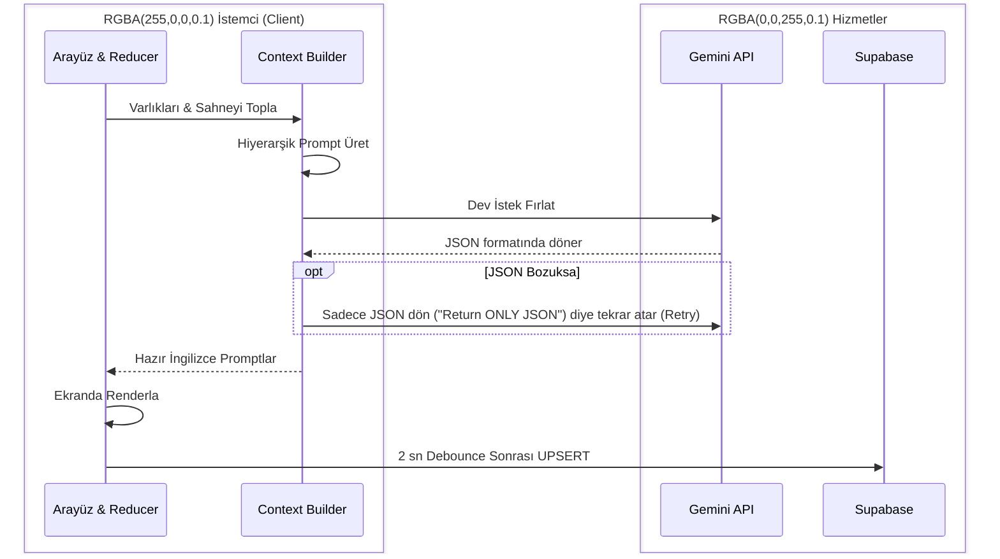

# Story Shot Studio (SSS) - Kapsamlı Sistem Analizi

Bu doküman, Story Shot Studio'nun (Prompt Forge 4.1.0) uçtan uca mimarisini, barındırdığı tüm enstrümanları, protokolleri, çalışma koşullarını ve hardcoded kurallarını en derin seviyede inceleyen teknik referans dosyasıdır.

## 1. Mimari Felsefe: "Kalın İstemci (Thick Client) Modeli"

SSS standart bir web uygulaması (ince istemci / thick server) değildir. Node.js veya Python gibi bir backend sunucusunda hiçbir iş mantığı (business logic) çalışmaz. Tüm ağır yük (Prompt mühendisliği, metin analitiği, state senkronizasyonu, JSON parçalama) doğrudan kullanıcının tarayıcısında (Client) çalışır.

### Kullanılan Ana Enstrümanlar
*   **Çerçeve (Framework):** React (Vite tabanlı).
*   **State Enstrümanı:** Merkezi bir `useReducer` barındıran Custom Hook (`useAppState`).
*   **Veritabanı Sağlayıcısı:** Supabase (Backend-as-a-Service, PostgreSQL). Sadece veri bekleyen "aptal ama güvenli" bir kasa görevi görür.
*   **Yapay Zeka Servisi:** Google Gemini API (Doğrudan istemciden çağrılır).

---

## 2. Ağ ve Veri Senkronizasyon Protokolleri

Tarayıcıdaki devasa durumun (State) kaybolmadan veritabanına aktarılması için katı protokoller yazılmıştır.

### A. Kriptografik Native UUID Protokolü
Frontend ile Backend arasındaki ID çakışmasını engellemek için sistem Supabase'in kimlik oluşturmasını beklemez.
*   **Koşul:** `dispatch({ type: 'ADD_SCENE' })` çağrıldığında ilk salisede `crypto.randomUUID()` ile evrensel bir ID oluşturulur.
*   **Sonuç:** Veri daha Supabase'e gitmeden kalıcı, gerçek ID'sini almıştır, böylece "Infinite Duplicate (Sonsuz Kopya)" bugları önlenmiştir.

### B. Optimistic UI & Debounced Sync (Senkronizasyon Protokolü)
Kullanıcı bir kelime yazdığında bekleme (loading) ekranı çıkmaz, UI anında kendini çizer.
1.  Kullanıcı tuşa basar -> Reducer State'i günceller (Optimistic UI - Anında Görüntü).
2.  `Index.tsx`'teki `useEffect` hook'u gizli bir kronometre başlatır.
3.  Tuşlamalar 2 saniye boyunca durursa (Debounce) "Sync" tetiklenir.
4.  Mevcut Payload, Supabase'e fırlatılır.

### C. Exponential Backoff (Hata Telafi) Protokolü
*   **Enstrüman:** `supabaseQueries.ts` içindeki `withRetry` fonksiyonu.
*   **Koşul:** Eğer internet koparsa ya da API Rate Limit (429) dönülürse sistem işlemi iptal etmez.
*   **Döngü:** Önce 2 sn, sonra 4 sn, sonra 8 sn bekleyerek inatla dener. Bu mekanizma "Hardcoded" olarak asenkron veri gönderme işlerinin kalbine gömülmüştür.

### D. UPSERT ve Soft-Delete Protokolü
*   **UPSERT (Update or Insert):** Veriler hiçbir zaman körlemesine `INSERT` komutuyla atılmaz. Veritabanına `.upsert(data, { onConflict: 'id' })` komutuyla "Varsa güncelle, yoksa yeni kayıt aç" mantığı işlenir.
*   **Soft-Delete:** Promptlar dahil hiçbir veri `DELETE` ile silinmez. Kullanıcı "sil" dediğinde veri `is_active = false` bayrağı alır. Bu koşul, versiyon kontrolü ("Prompt History" zaman makinesi) yapabilmek için tasarlanmıştır.

---

## 3. Yapay Zeka (AI) Motorları ve İş Hatları (Pipelines)

Yapay zeka tek boyutlu çalışmaz. İki farklı motor birbirine zincirleme bağlıdır:

### Motor 1: Sahne Analisti (`sceneAnalyzer.ts`)
*   **Görevi:** Dev metni okuyup, statik (hareketsiz) sinema karelerine uygun sahne kartlarına bölmek.
*   **Koşul:** AI'ya "Hareketi anlatma (Video değil), duran kareyi anlat (Resim)" talimatı sertçe verilmiştir. JSON formatında `{ scenes: [...], entities: [...] }` döner.
*   **Protokol (Self-Healing):** Eğer AI bozuk bir string dönerse (örn: başında "```json" gibi markdown karakterleri varsa), sistemdeki "Resilient JSON Parser" string operasyonlarıyla bunu temizler ve ayrıştırır.

### Motor 2: Dev Context Builder (`promptGenerator.ts`)
*   **Görevi:** Arayüzdeki dağınık verileri kusursuz bir mühendislik prompt'una yedirmek.
*   **Hiyerarşi Protokolü:** AI'ya gönderilecek metin şu sırayla bağlanır ve en alttaki en üsttekini ezer (ağırlık artar):
    1.  *Master Prompt (Proje Anayasası)*
    2.  *Episode Prompt (Bölüm Özel Anayasası) -> Master'ı Over-ride eder.*
    3.  *Sahne Metni ve Karakter/Mekan Betimlemeleri (Entities).*
    4.  *Görsel Yönlendirme (Asıl Odak).*
    5.  *Aspect Ratio & Lens komutları (En Speseifik kural).*
*   **Çıktı Koşulu:** Kendisinden 1 x Wide Shot, 1 x Medium Shot, 1 x Close-up promptu istenir.

### Motor 3: Revizyon Yoğurucusu (`revisePrompt`)
*   **Görevi:** Var olan mükemmel İngilizce promptu **bozmadan**, sadece kullanıcının kısa bir Türkçe direktifini (Örn: "Adamın elindeki elma kırmızı olsun") içeriğe zerk etmektir.
*   **Koşul:** Eski prompt `is_active: false` yapılır, yeni prompt `generation_type: 'revision'` bayrağı ile kaydedilir.



---

## 4. Veri Hiyerarşisi Modeli

Veritabanındaki (Supabase) ve Memory'deki (State) varlık ilişkileri NoSQL'e benzer bir elastikiyetle kurgulanmıştır.

*   **Projects Tablosu:** `id`, `title`, `master_prompt`.
*   **Global Entities:** Karakterler ve Mekanlar kendi ayrı tablolarında **tutulmaz**. Bunlar JSONB formatında projeye ya da bölüme gömülü olarak tutulur. Bu, son derece elastik bir yapı sunar.
*   **Episodes Tablosu:** `character_data` (JSONB), `location_data` (JSONB) alanlarında varlıkları taşır. `episode_prompt` ile Master promptun üzerine bölüm temasını basar.
*   **SCENES Tablosu:** Sahneler direkt ilişkisel (relational) id'leri tutar (`character_ids: ["uuid-1", "uuid-2"]`).
*   **PROMPTS Tablosu:** Versiyonlamayı barındırır. Yeni jenerasyon tipi kolonlarıyla (`generation_type`) bir promptun ilk üretim mi yoksa revizyon mu olduğu etiketlenir.

---

## 5. Uygulama İçi Arayüz ve Kullanıcı (UI/UX) Protokolleri

Kullanıcının sistemi sorunsuz yönetebilmesi için kritik protokoller işletilir:

*   **Kilitlenen Durumlar (Loading States):** AI ile konuşulurken, UI donmaz. " generating" statüsü sahneye eklenir ve karta "Skeleton" animasyonlu bir overlay biner. Revizyonda ise sadece revize tuşu loading'e döner.
*   **Sürükle-Bırak Dizilim (Drag & Drop Float Ordering):** Sahnelerin sırasını listelemek için katı 1, 2, 3 ID'leri kullanılmaz. Matematikteki ondalık sistem protokolü kullanılır; eğer kart 3 ve 4 arasına bırakılırsa yeni kartın sırası 3.5 olur `(Önceki + Sonraki) / 2`.
*   **Inline Prompt Modification:** Arayüzde hiçbir zaman sayfa değişmez, bir pop-up'a gidilmez. Sahne kartının içindeki Revizyon Kutusu'na (Inline Input) komut girilip direkt lokal işlem yapılır. Eski versiyonlara dönmek isteyen kullanıcı UI'daki "Saat (History)" tıklar ve Modal açılır.

---

## 6. Hardcoded (Sarsılmaz) Sistem Kuralları Özeti

Aşağıdaki mekanizmalar uygulamanın kemiğidir. Bu dosyalardaki logic'in değişmesi sistemin domino etkisiyle çökmesine yol açar:

1.  **ID Yönetimi:** Her şey doğduğu an `crypto.randomUUID()` almak ZORUNDADIR. Kesinlikle string tabanlı `id: "scene-123"` ataması yapılamaz.
2.  **State İletişimi:** Alt componentler state'e doğrudan "Şunu kaydet" diyemez. Yalnızca `useAppState.ts`'te tanımlanan payload tiplerine uygun Action (`dispatch`) atıp çekilmektelerdir.
3.  **Çakışma / Merge Yönetimi:** Prompt uretiminde `episodePrompt`, `masterPrompt` u ezer. "Episode Override" protokolü sabittir.
4.  **Backend Trafiği:** `supabaseQueries.ts` dışında hiç bir dosya `.from('table').upsert()` tetikleyemez. Veri akışı tek kanaldan debounce ve backoff (hata telafisi) süzgecinden geçerek veritabanına ulaşır.
5.  **Soft Deletion:** Hiçbir SQL sorgusunda silme (DELETE CASCADE vb.) yazılı değildir. Her şey geçmişi korumak için arşivlenir (`is_active: false`).
