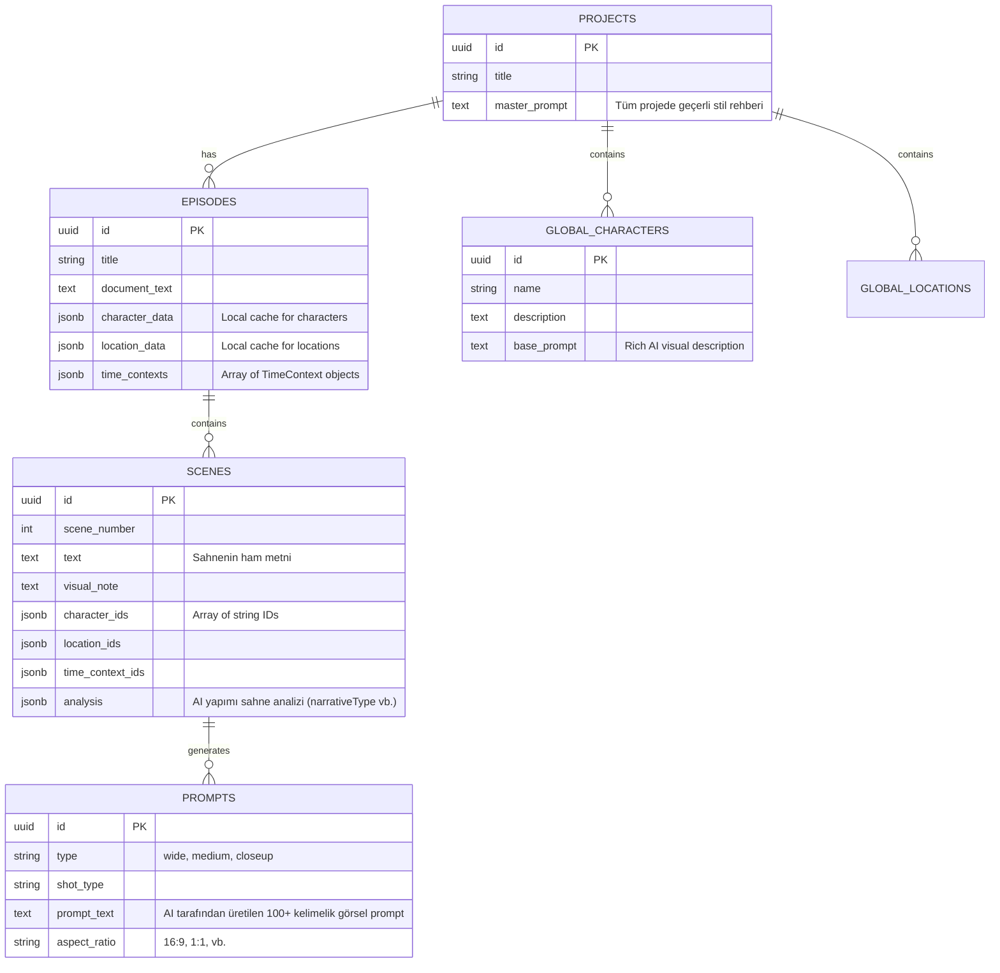
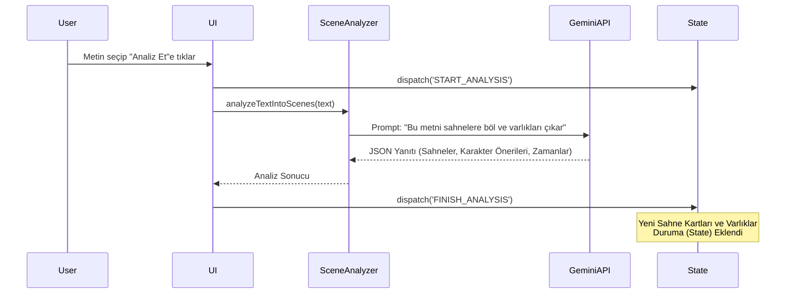
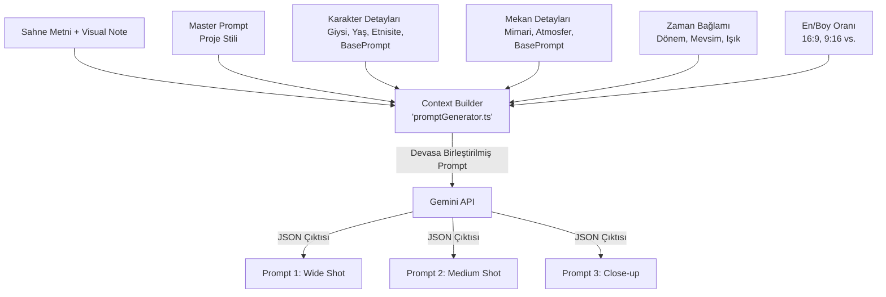
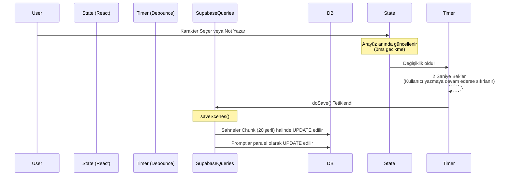

# Story Shot Studio - Kapsamlı Sistem & Mimari Dokümantasyonu

Bu doküman, Story Shot Studio'nun (SSS) uçtan uca mimarisini, veri akışını (data flow), durum yönetimini (state management), yapay zeka entegrasyonlarını ve veritabanı şemasını detaylı grafiklerle açıklamaktadır.

---

## 1. Yüksek Seviye Sistem Mimarisi (High-Level Architecture)

Story Shot Studio, frontend ağırlıklı (React + Vite) bir "Kalın İstemci (Thick Client)" mimarisine sahiptir. Tüm ağır iş mantığı (AI istemi oluşturma, sahne analizi, metin parçalama) istemcide çalışır ve durum Senkronizasyonu (State Sync) için Supabase'i (PostgreSQL) kullanır.

```mermaid
graph TD
    subgraph Frontend [İstemci (React + Vite)]
        UI[Kullanıcı Arayüzü / Paneller]
        State[Global State: useAppState]
        Parser[Text Parser & Splitter]
        AI_Orchestrator[AI Provider & Prompters]
    end

    subgraph Backend [Supabase]
        DB[(PostgreSQL)]
        Auth[Supabase Auth]
    end

    subgraph External [Dış Servisler]
        Gemini[Google Gemini API]
    end

    UI <-->|dispatch / select| State
    Parser --> State
    State <-->|Batch Sync (Debounced)| DB
    AI_Orchestrator <-->|Prompt Generation| Gemini
    State --> AI_Orchestrator
    AI_Orchestrator --> State
```

---

## 2. Supabase Veritabanı Şeması (Database Schema)

Sistem, hiyerarşik bir ilişki modeline dayanır. Projeler üst taşıyıcıdır; bölümler (episodes) metni barındırır, sahneler bölümlere, promptlar ise sahnelere aittir. Karakter ve Mekanlar (Global Entities) ise doğrudan Projeye bağlıdır, böylece bölüm (episode) değiştirilse bile aynı karakter kullanılabilir.



---

## 3. Yapay Zeka (AI) İş Akışı (The AI Pipeline)

Yapay zeka sistemi, iki aşamalı (Two-Stage) bir motor olarak çalışır. İlk motor metni anlar ve planlar; ikinci motor ise bu plana göre sanat yönetmenliği yapar.

### Aşama 1: Sahne Analisti ([sceneAnalyzer.ts](file:///c:/Users/gcmsx/Desktop/prompt_forge_2/story-shot-studio/src/lib/sceneAnalyzer.ts))



- **Girdi:** Kullanıcıdan gelen çiğ metin.
- **Görev:** Metni mantıksal çekim sahnelerine (Scene Cards) ayırmak, her sahnenin zorluk derecesini (`temporalComplexity`) hesaplamak, "Bu sahnede kimler var?" (Entity Extraction) sorusuna yanıt bulmak.

### Aşama 2: Prompt Jeneratörü ([promptGenerator.ts](file:///c:/Users/gcmsx/Desktop/prompt_forge_2/story-shot-studio/src/lib/promptGenerator.ts))

Kullanıcı arayüzde (UI) varlıklara (`Mahya Ustası`) özellik ("middle-aged, traditional clothes") atayıp "Üret (Generate)" dediğinde çalışan asıl beyindir.



- **Context Builder Özelliği:** Sistemin akıllılığı buradadır. Eğer sadece `Mahya Ustası` gönderilse AI kafasına göre çizer. Uygulama veritabanındaki varlıkları filtreler, dolgulu alanları okur ve devasa bir "Görünmez Sahne Ön-Bilgisi" yaratır. Özellikle `basePrompt` alanındaki veriler `Visual reference: {basePrompt}` etiketiyle LLM'e enjekte edilir.

---

## 4. State Management (Durum Yönetimi) ve Otomatik Kayıt (Auto-Save)

Uygulamanın merkez sinir sistemi [src/hooks/useAppState.ts](file:///c:/Users/gcmsx/Desktop/prompt_forge_2/story-shot-studio/src/hooks/useAppState.ts) içerisindeki Reducer yapısıdır. Devasa ve iç içe (nested) veriler sebebiyle klasik `useState` yerine katı kurallı (Action-Payload) bir `useReducer` kullanılmıştır.

### Auto-Save (Otomatik Kayıt) Mekanizması

Uygulamada "Kaydet" butonu yoktur. Mimari Optimistic UI ve Debounce pattern üzerine kuruludur.



### Bağlantı Tufanını (Connection Storm) Önleme

Eski versiyonlarda bölüm (episode) yüklendiğinde 60 sahneli bir projede 60 ayrı [fetchPrompts](file:///c:/Users/gcmsx/Desktop/prompt_forge_2/story-shot-studio/src/lib/supabaseQueries.ts#291-300) isteği Supabase'e atılıyor ve CORS/500 hataları alınıyordu.

Yeni Mimaride (Batching):
- [fetchAllPromptsForScenes(sceneIds)](file:///c:/Users/gcmsx/Desktop/prompt_forge_2/story-shot-studio/src/lib/supabaseQueries.ts#301-325) kullanılarak tüm promptlar tek bir `.in('scene_id', [dizi...])` SQL komutuyla çekilir. 
- Supabase'den dönen devasa liste, Javascript üzerinde bir `Map<string, any[]>` (Hash map) objesine çevrilir ve id'lerine göre [O(1)](file:///c:/Users/gcmsx/Desktop/prompt_forge_2/story-shot-studio/src/lib/geminiApi.ts#57-75) (sabit zaman) karmaşıklığında sahnelerine atanır. Ağ trafiği %99 oranında azaltılmıştır.

---

## 5. Uygulama Dosya Yapısı (Core Directory Structure)

| Klasör / Dosya | Görev |
| :--- | :--- |
| [src/pages/Index.tsx](file:///c:/Users/gcmsx/Desktop/prompt_forge_2/story-shot-studio/src/pages/Index.tsx) | Beyin kontrol merkezi. UI bileşenlerini asamble eder, Supabase ile State'i konuşturur, Keyboard Kısayollarını (Ctrl+Z) dinler. |
| [src/hooks/useAppState.ts](file:///c:/Users/gcmsx/Desktop/prompt_forge_2/story-shot-studio/src/hooks/useAppState.ts) | Global State (Reducer). Undo/Redo özellikleri, varlık ilişkileri, state merge (zaman bağlamı gibi) operasyonları buradadır. |
| [src/components/RightPanel.tsx](file:///c:/Users/gcmsx/Desktop/prompt_forge_2/story-shot-studio/src/components/RightPanel.tsx) | Prompt üretimi, sahne notları, render tuşları ve AI üretim tetikleyicilerinin bulunduğu ana yan panel. |
| [src/lib/geminiApi.ts](file:///c:/Users/gcmsx/Desktop/prompt_forge_2/story-shot-studio/src/lib/geminiApi.ts) | Google Gemini servisiyle (REST tabanlı) konuşan çekirdek API paketleyici. Token limiti, Retry mantığı buradadır. |
| [src/lib/promptGenerator.ts](file:///c:/Users/gcmsx/Desktop/prompt_forge_2/story-shot-studio/src/lib/promptGenerator.ts) | GeminiAPI'ye gidecek "kullanıcıdan görünmez devasa prompt" metninin (Entity'ler + Master Prompt) legolar gibi birleştirildiği yer. |
| [src/lib/supabaseQueries.ts](file:///c:/Users/gcmsx/Desktop/prompt_forge_2/story-shot-studio/src/lib/supabaseQueries.ts) | Exponential Backoff (üstel geri çekilme) destekli Supabase sorguları. Olası ağ kopmalarında isteklerin çökmesi engellenir. |
| [src/types/index.ts](file:///c:/Users/gcmsx/Desktop/prompt_forge_2/story-shot-studio/src/types/index.ts) | Sistemin TypeScript DNA'sı. [SceneCard](file:///c:/Users/gcmsx/Desktop/prompt_forge_2/story-shot-studio/src/types/index.ts#151-165), [PromptVariant](file:///c:/Users/gcmsx/Desktop/prompt_forge_2/story-shot-studio/src/types/index.ts#8-19) ve Veritabanı Entity arayüzlerinin tiplerini barındırır. |

---

## 6. Uzman İpuçları ve En İyi Pratikler (Best Practices)

1. **Antropolojik Tutarlılık (Anthropological Consistency):** Uygulama son halindeki güncellemeyle Karaktere/Mekana yazılan `basePrompt` verisini kayıpsız kullanır. Yüz veya giysi tutarlılığı için bu alana `--cref url` veya detaylı 16. Yüzyıl kumaş terminolojisi girmek Midjourney gibi render motorlarında hatasız devamlılık sağlar.
2. **Optimizasyon Grubu (Consistency Groups):** Aynı mekanı/karakteri içeren Sahneler "A, B, C" gibi harflerle "Consistency Group" a alınır. Prompt motoru bunu algılar ve bağlı olduğu grubu AI'ya bildirerek "Group A'nın önceki sahnesiyle ortam ışığını koru" komutunu otomatik yaratır.
