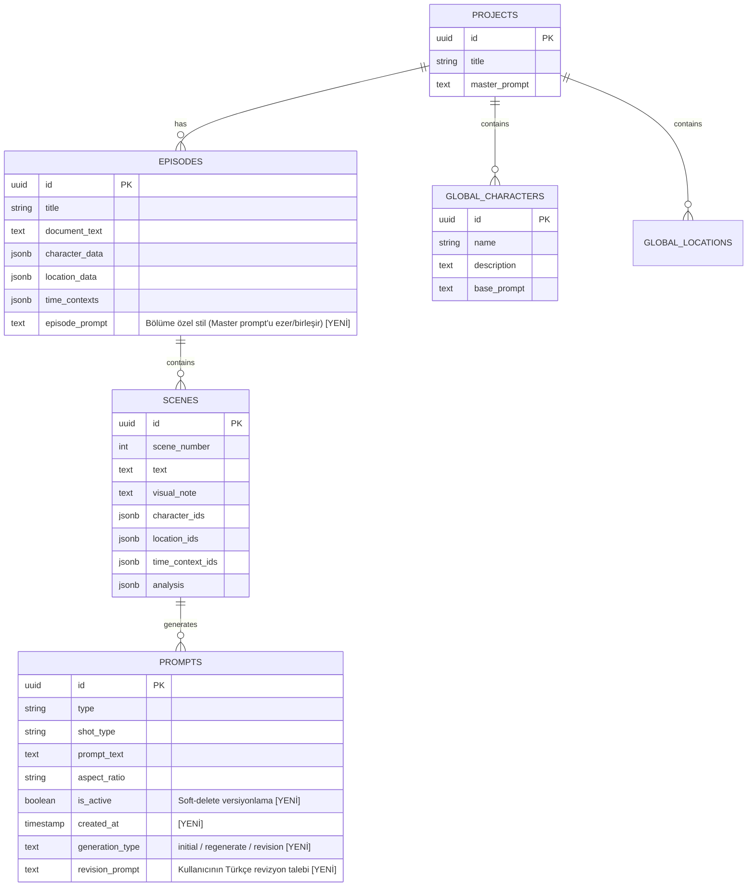
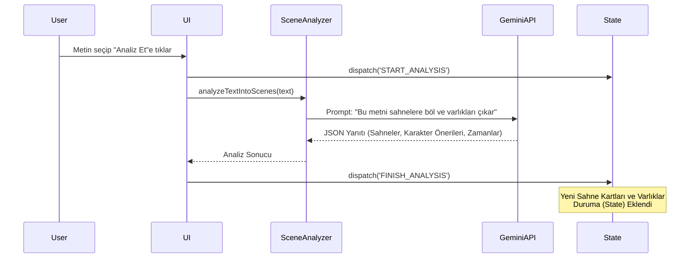
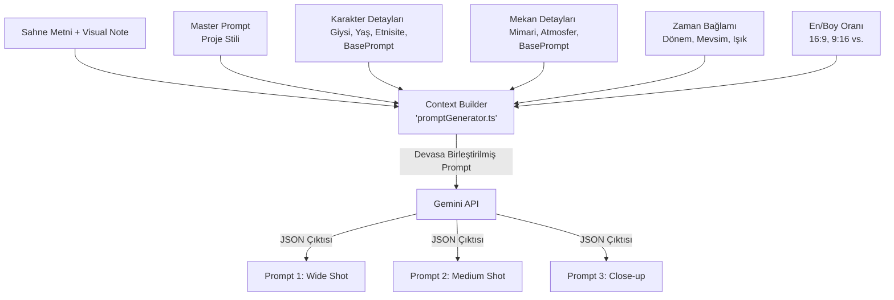

# Story Shot Studio - Kapsamlı Sistem & Mimari Dokümantasyonu

Bu doküman, Story Shot Studio'nun (SSS) uçtan uca mimarisini, veri akışını (data flow), durum yönetimini (state management), yapay zeka entegrasyonlarını ve veritabanı şemasını detaylı grafiklerle açıklamaktadır.

---

## 1. Yüksek Seviye Sistem Mimarisi (High-Level Architecture)

Story Shot Studio, frontend ağırlıklı (React + Vite) bir "Kalın İstemci (Thick Client)" mimarisine sahiptir. Tüm ağır iş mantığı (AI istemi oluşturma, sahne analizi, metin parçalama) istemcide çalışır ve durum Senkronizasyonu (State Sync) için Supabase'i (PostgreSQL) kullanır.

```mermaid
graph TD
    subgraph Frontend [İstemci (React + Vite)]
        UI[Kullanıcı Arayüzü / Paneller]
        State[Global State: useAppState]
        Parser[Text Parser & Splitter]
        AI_Orchestrator[AI Provider (Resilient JSON Parser)]
    end

    subgraph Backend [Supabase]
        DB[(PostgreSQL)]
        Auth[Supabase Auth]
    end

    subgraph External [Dış Servisler]
        Gemini[Google Gemini API]
    end

    UI <-->|dispatch / select| State
    Parser --> State
    State <-->|Batch Sync (Debounced)| DB
    AI_Orchestrator <-->|Prompt Generation| Gemini
    State --> AI_Orchestrator
    AI_Orchestrator --> State
```

---

## 2. Supabase Veritabanı Şeması (Database Schema)

Sistem, hiyerarşik bir ilişki modeline dayanır. Projeler üst taşıyıcıdır; bölümler (episodes) metni barındırır, sahneler bölümlere, promptlar ise sahnelere aittir. Karakter ve Mekanlar (Global Entities) ise doğrudan Projeye bağlıdır, böylece bölüm (episode) değiştirilse bile aynı karakter kullanılabilir.



---

## 3. Yapay Zeka (AI) İş Akışı (The AI Pipeline)

Yapay zeka sistemi, iki aşamalı (Two-Stage) bir motor olarak çalışır. İlk motor metni anlar ve planlar; ikinci motor ise bu plana göre sanat yönetmenliği yapar.

### Aşama 1: Sahne Analisti (`sceneAnalyzer.ts`)



- **Girdi:** Kullanıcıdan gelen çiğ metin.
- **Görev:** Metni mantıksal çekim sahnelerine (Scene Cards) ayırmak, her sahnenin zorluk derecesini (`temporalComplexity`) hesaplamak, "Bu sahnede kimler var?" (Entity Extraction) sorusuna yanıt bulmak.
- **⚠️ Bilinen Sorun:** Analiz prompt'u her cümleyi ayrı sahneye bölebiliyor, 70 sayfalık metinden 98 sahne çıkıyor. `sceneAnalyzer.ts` sistem prompt'una maksimum sahne sayısı sınırı eklenmesi gerekiyor.

### Aşama 2: Prompt Jeneratörü (`promptGenerator.ts`)

Kullanıcı arayüzde (UI) varlıklara (`Mahya Ustası`) özellik ("middle-aged, traditional clothes") atayıp "Üret (Generate)" dediğinde çalışan asıl beyindir.



#### AI Prompt'unun (Görünmez İstem) Anatomisi

`generatePromptsForScene` fonksiyonu, arka planda devasa bir metin bloğu inşa eder. Arayüzde küçük görünen Sahne Kartları, yapay zekaya giderken aşağıdaki formatta dev bir direktife dönüşür:

```markdown
SAHNE METNİ: (Ham türkçe metin)
TÜRKÇE GÖRSEL NOT: (Kullanıcının sahneye girdiği not)

CHARACTERS IN THIS SCENE:
- Mahya Ustası (craftsman), middle-aged, ethnicity: Ottoman Turkish...
  Visual reference: A middle-aged Ottoman craftsman...

LOCATIONS IN THIS SCENE:
- Süleymaniye Camii (16th Century), architecture: Classical Ottoman...

HISTORICAL/TEMPORAL CONTEXT:
- Ramazan Gecesi (Ottoman Era), weather: Clear night...

MASTER PROMPT: (Proje genel stil kuralları)
[EPISODE STYLE OVERRIDE: Bölüme özel stil — varsa masterPrompt'un üstüne eklenir]

🎬 ASPECT RATIO: 16:9
🔍 SAHNE ANALİZİ: narrativeType: static / sequence / timelapse
```

- **Episode Style Override:** `episodePrompt` varsa `masterPrompt` ile şu şekilde birleşir: `${masterPrompt}\n\nEPISODE STYLE OVERRIDE:\n${episodePrompt}` — master'ı silmez, üstüne yazar.
- **Fail-Safe (Çökme Koruması):** İlk JSON parse denemesi çökerse `"Return ONLY valid JSON"` ikazı ekleyerek 1 retry yapar. Çökmeler %95 oranında önlenmiştir.

### Aşama 3: Prompt Revizyonu (`promptGenerator.ts` → `revisePrompt()`)

Kullanıcı mevcut bir promptu Türkçe bir talimatla revize edebilir.

```mermaid
sequenceDiagram
    participant User
    participant InlinePromptCard
    participant Index.tsx
    participant revisePrompt()
    participant GeminiAPI

    User->>InlinePromptCard: Revizyon kutusuna "Hava yağmurlu olsun" yazar
    InlinePromptCard->>Index.tsx: onRevise(sceneId, promptId, instruction)
    Index.tsx->>revisePrompt(): revisePrompt(oldPromptText, instruction)
    revisePrompt()->>GeminiAPI: "Orijinal promptu koru, sadece yönetmen isteğini entegre et"
    GeminiAPI-->>revisePrompt(): Yeni İngilizce prompt
    revisePrompt()-->>Index.tsx: Güncel prompt metni
    Index.tsx->>Index.tsx: Eski prompt is_active=false, yeni prompt INSERT
    Note over Index.tsx: generation_type: 'revision'<br/>revision_prompt: "Hava yağmurlu olsun"
```

---

## 4. State Management (Durum Yönetimi) ve Otomatik Kayıt (Auto-Save)

Uygulamanın merkez sinir sistemi `src/hooks/useAppState.ts` içerisindeki Reducer yapısıdır.

### Auto-Save Mekanizması

Uygulamada "Kaydet" butonu yoktur. Optimistic UI + Debounce pattern üzerine kuruludur. Kullanıcı bir değişiklik yaptığında arayüz anında güncellenir, 2 saniye sonra Supabase'e yazılır.

### Ölümcül Döngü (Infinite Duplicate Bug) ve "Stable UUID" Çözümü

**Eski Sorun:** React geçici `scene-138374` gibi ID'ler üretiyordu. Supabase bunları reddedip yeni UUID atıyordu. React'teki ID ile DB'deki ID uyuşmuyordu. Her auto-save'de sahneler ve promptlar tekrar INSERT ediliyordu → geçmişte 20+ kopya birikiyordu.

**Çözüm (Stable Native UUIDs):** Artık her varlık (Sahne, Karakter, Prompt) doğduğu anda `crypto.randomUUID()` alır. Bu ID hiç değişmez. `saveScenes` UPSERT (`onConflict: 'id'`) kullanır.

- **Batching:** `fetchAllPromptsForScenes(sceneIds)` ile tüm promptlar tek `.in()` sorgusunda çekilir, HashMap ile O(1) atanır.
- **Prompt Soft-Delete:** "Yeniden Üret" → eski promptlar `is_active=false`, yeni promptlar INSERT. `fetchPromptHistory` ile geçmişe erişilir, `generation_type` ile (İlk Üretim / Yeniden Üretim / Revizyon) etiketlenir.

---

## 5. Uygulama Dosya Yapısı (Core Directory Structure)

| Klasör / Dosya | Görev |
| :--- | :--- |
| `src/pages/Index.tsx` | Beyin kontrol merkezi. UI bileşenlerini asamble eder, Supabase ile State'i konuşturur, Keyboard Kısayollarını (Ctrl+Z) dinler. |
| `src/hooks/useAppState.ts` | Global State (Reducer). Undo/Redo, varlık ilişkileri, state merge operasyonları. |
| `src/components/RightPanel.tsx` | Prompt üretimi, sahne notları, render tuşları ve AI üretim tetikleyicileri. |
| `src/components/SceneCard.tsx` | Sahne kartı + InlinePromptCard (revizyon input'u dahil). |
| `src/components/PromptHistoryModal.tsx` | **[YENİ]** Sahne prompt geçmişini listeler, geri yükleme sağlar. |
| `src/components/EntityCardPanel.tsx` | Karakter ve Mekan editörleri. ✨ AI ile Geliştir butonu dahil. |
| `src/lib/geminiApi.ts` | Google Gemini servisiyle konuşan çekirdek API paketleyici. Token limiti, Retry mantığı. |
| `src/lib/promptGenerator.ts` | Context Builder + `generatePromptsForScene()` + `revisePrompt()` [YENİ]. |
| `src/lib/supabaseQueries.ts` | Exponential Backoff destekli Supabase sorguları. `fetchPromptHistory` [YENİ]. |
| `src/types/index.ts` | TypeScript DNA'sı. `SceneCard`, `PromptVariant`, `AppState` arayüzleri. |

---

## 6. Geliştirici Kuralları: "Do Not Touch"

Gelecekteki AI asistanların **bozmaması** gereken hayati yapılar:

1. **`supabaseQueries.ts` Exponential Backoff (`withRetry`):** Tekil `for` loop CRUD'a izin verilmez, her zaman `upsert` veya `.in()` kullanılır.
2. **`promptGenerator.ts` Context Merging Mimarisi:** `episodePrompt` merge sırası, JSON Retry döngüsü, `basePrompt` birleştirme hassas ve sıralıdır.
3. **`useAppState.ts` Devasa Reducer:** Yapısı narindir. Yalnızca `types/index.ts` ile eşleşen action/payload ile genişletin.
4. **`crypto.randomUUID()` Stable ID Sistemi:** Hiçbir varlığa geçici string ID atanmaz. Her varlık doğduğu anda gerçek UUID alır ve bu ID asla değişmez.

---

## 7. AI Modeli Kod Üretim Referansları (TypeScript Signatures)

```typescript
// promptGenerator.ts Ana Fonksiyon
export async function generatePromptsForScene(
  scene: SceneCard,
  characters: Character[],
  locations: Location[],
  masterPrompt: string,
  _apiKey?: string,
  _model?: string,
  aspectRatio: '16:9' | '4:3' | '1:1' | '9:16' = '16:9',
  sceneAnalysis?: SceneAnalysis,
  timeContexts?: TimeContext[],
  episodePrompt?: string
): Promise<GenerationResult>

// promptGenerator.ts Revizyon Fonksiyonu [YENİ]
export async function revisePrompt(
  oldPromptText: string,
  instruction: string  // Kullanıcının Türkçe talebi
): Promise<string>

// AppState (useAppState.ts)
export interface AppState {
  episodePrompt: string;
  masterPrompt: string;
  // Tüm alanlar için src/types/index.ts baz alınmalıdır.
}

// PromptVariant (Soft-Delete Uyumlu)
export interface PromptVariant {
  id: string;
  is_active?: boolean;       // false = geçmiş versiyon
  created_at?: string;
  generation_type?: 'initial' | 'regenerate' | 'revision';
  revision_prompt?: string;  // Türkçe revizyon talebi
}
```

---

## 8. Frontend (UI/UX) Durumu ve Yol Haritası

### ✅ Tamamlanan UI Özellikleri

| Özellik | Bileşen | Durum |
| :--- | :--- | :--- |
| Prompt History Modal (🕐 saat ikonu) | `PromptHistoryModal.tsx` + `SceneCard.tsx` | ✅ Aktif |
| ✨ AI ile Geliştir (Karakter & Mekan) | `EntityCardPanel.tsx` | ✅ Aktif |
| Prompt Revizyon Sistemi | `SceneCard.tsx` + `Index.tsx` | ✅ Aktif |
| Prompt geçmişinde generation_type rozeti | `PromptHistoryModal.tsx` | ✅ Aktif |
| Buton stilleri (ghost, minimal) | `SceneCard.tsx` | ✅ Aktif |

### 🔴 Kalan UI Eksikleri

1. **Episode Style Textarea** — Backend + State hazır. Sol panelde veya bölüm başlığı altına `SET_EPISODE_PROMPT` action'ını tetikleyen bir `Textarea` eklenmesi gerekiyor.

2. **Batch Generation Progress Bar** — `handleGenerateAllPrompts` fonksiyonu `Index.tsx`'te mevcut. "Tümünü Üret" butonuna "23/60 üretiliyor..." ilerleme göstergesi eklenmesi gerekiyor.

3. **Drag & Drop Float Ordering** — DB'de `NUMERIC`, state'te hazır. Sürükle-bırak UI'ında `(Önceki + Sonraki) / 2` algoritmasıyla yeni sıra numarası atanması gerekiyor.

4. **JSON Retry Toast Bildirimi** — Retry tetiklendiğinde kullanıcıya "Yapay zeka yanıtı bozuk geldi, onarılıyor..." toast mesajı gösterilmesi gerekiyor.

5. **sceneAnalyzer.ts Sahne Sınırı** — Analiz prompt'una maksimum sahne sayısı kuralı eklenmesi gerekiyor (şu an ~70 sayfalık metin 98 sahne üretiyor).